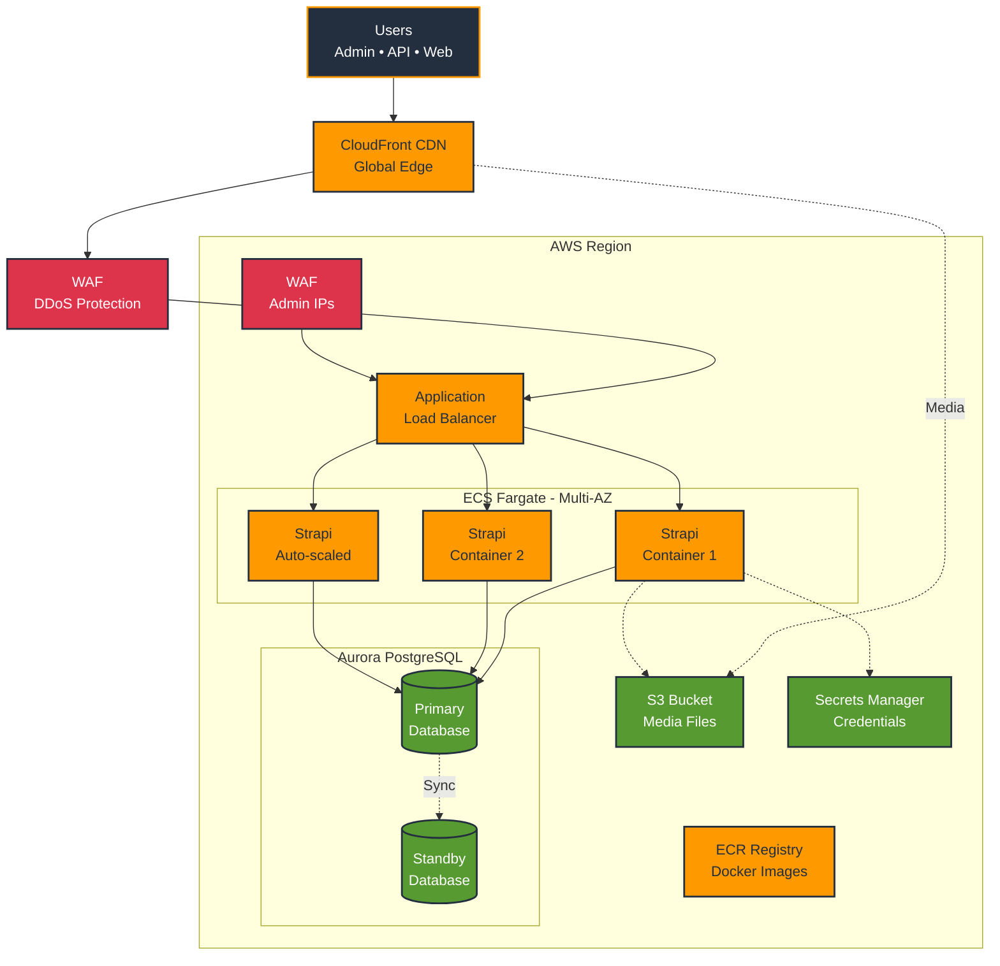

# Strapi AWS Architecture - Simplified Mermaid Diagram

## Key Features

- **High Availability**: Multi-AZ deployment with automatic failover
- **Auto-scaling**: ECS tasks scale from 2 to 10 based on load
- **Global CDN**: CloudFront serves content from 400+ edge locations
- **Dual WAF**: Protection at both CDN and ALB layers
- **Managed Services**: No servers to maintain

## Simplified Cost Breakdown

- **Small (Dev)**: ~$300/month
- **Medium (Production)**: ~$500/month  
- **Large (High Traffic)**: ~$1000+/month