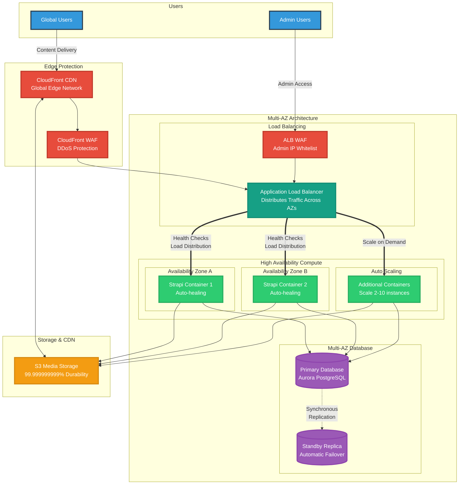

# Strapi AWS High Availability - Simplified Architecture

## Executive Summary Diagram

This simplified diagram shows the key high-availability components of the Strapi AWS architecture.



## Key High Availability Features

### 🌍 **Global Availability**
- **CloudFront CDN**: 400+ edge locations worldwide
- **Cached Content**: Served even during origin failures
- **Geographic Distribution**: Low latency for all users

### 🛡️ **Multi-Layer Security**
- **Edge Protection**: DDoS mitigation at CloudFront
- **Application Protection**: WAF rules and IP whitelisting
- **Network Isolation**: Private subnets for compute and database

### ⚖️ **Load Distribution**
- **Multi-AZ ALB**: Distributes traffic across availability zones
- **Health Checks**: Automatic detection and rerouting
- **No Single Point of Failure**: Redundancy at every layer

### 🔄 **Automatic Failover**
- **Container Recovery**: Failed containers replaced automatically
- **Database Failover**: Standby promoted in <30 seconds
- **Zero Downtime**: Users unaffected by component failures

### 📈 **Elastic Scalability**
- **Auto-scaling**: 2-10 containers based on load
- **Instant Response**: Scale out in 60 seconds
- **Cost Efficient**: Scale down during low traffic

### 💾 **Data Durability**
- **Multi-AZ Database**: Synchronous replication
- **S3 Storage**: 11 nines of durability
- **Automated Backups**: 7-day retention with PITR

## Business Benefits

| Feature | Benefit | Business Impact |
|---------|---------|-----------------|
| Multi-AZ Deployment | 99.9%+ Uptime | No lost revenue from outages |
| Auto-scaling | Handle traffic spikes | Support viral content/campaigns |
| Global CDN | Fast page loads worldwide | Better user experience |
| Automated Failover | Self-healing infrastructure | Reduced ops overhead |
| WAF Protection | Block malicious traffic | Prevent security incidents |

## Cost Efficiency

Despite the redundancy and high availability features, the solution remains cost-effective:

- **Starting at ~$500/month** for production
- **Pay only for what you use** with auto-scaling
- **Reserved Instance discounts** available
- **No wasted capacity** with serverless containers

## Quick Deployment

```bash
# Deploy entire infrastructure in ~20 minutes
./deploy-three-phase.sh \
  --project-name myproject \
  --environment production \
  --region us-west-2 \
  --force
```

The infrastructure is defined as code, making it:
- **Repeatable**: Deploy multiple environments identically
- **Version Controlled**: Track all infrastructure changes
- **Peer Reviewed**: Infrastructure changes go through code review
- **Disaster Recovery**: Rebuild entire infrastructure from code