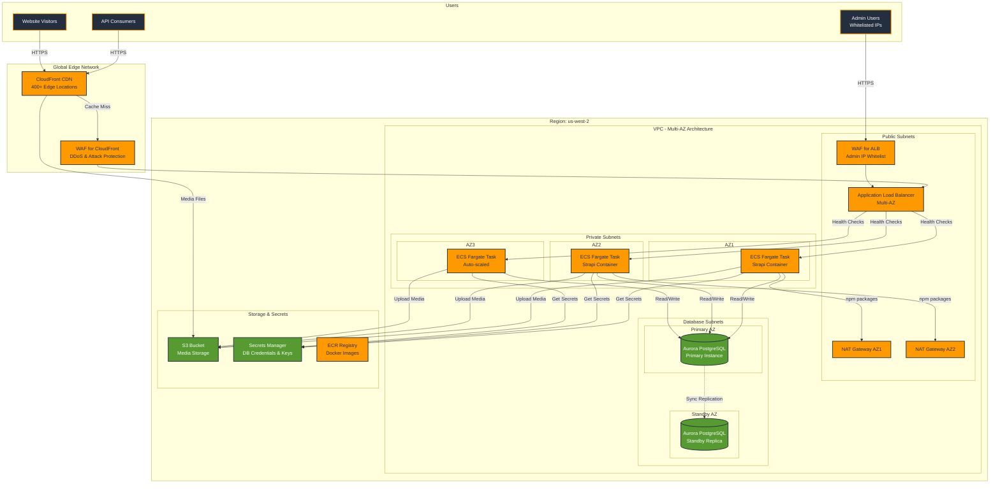

# Building a Highly Available Strapi CMS on AWS: A Production-Ready Architecture

## Introduction

Content Management Systems (CMS) are critical infrastructure components for modern businesses. When your CMS goes down, content updates stop, APIs fail, and dependent applications suffer. This post explores how to deploy Strapi, a popular headless CMS, on AWS with true high availability, automatic failover, and enterprise-grade security.

Our solution achieves:
- **99.9%+ uptime** through Multi-AZ redundancy
- **Automatic failover** in case of infrastructure failures  
- **Global content delivery** via CloudFront CDN
- **Enterprise security** with AWS WAF protection
- **Elastic scalability** to handle traffic spikes
- **Cost optimization** starting at ~$500/month

## The Challenge: Why High Availability Matters

Traditional single-server CMS deployments create several risks:
- **Single Point of Failure**: One server failure brings down your entire CMS
- **Performance Bottlenecks**: Limited by single server capacity
- **Security Vulnerabilities**: Direct exposure to internet attacks
- **Scalability Limits**: Vertical scaling hits hardware limits quickly
- **Regional Latency**: Users far from your server experience slow load times

## Our Solution: Multi-AZ Architecture on AWS

We've designed a battle-tested architecture that leverages AWS managed services to eliminate single points of failure while maintaining cost efficiency.

### Key Architectural Components

#### 1. **Multi-AZ VPC Foundation**
- 3 Availability Zones for maximum redundancy
- Public subnets for load balancers
- Private subnets for application containers
- Database subnets isolated from internet

#### 2. **Containerized Strapi on ECS Fargate**
- Serverless containers eliminate EC2 management
- Automatic distribution across multiple AZs
- Built-in health checks and auto-recovery
- Seamless rolling deployments

#### 3. **Aurora PostgreSQL Multi-AZ Database**
- Managed database with automatic failover
- Read replicas for performance
- Point-in-time recovery
- Automated backups with 7-day retention

#### 4. **Application Load Balancer**
- Distributes traffic across healthy containers
- SSL/TLS termination
- Health check monitoring
- Automatic failover between AZs

#### 5. **S3 + CloudFront for Media**
- Unlimited media storage
- Global CDN with 400+ edge locations
- Automatic image optimization
- Reduced load on application servers

#### 6. **AWS WAF Protection**
- DDoS protection
- SQL injection prevention
- Rate limiting
- IP-based access control for admin panel

## Architecture Diagram



## How High Availability Works

### 1. **Application Layer Redundancy**
- Minimum 2 Strapi containers running across different AZs
- Application Load Balancer continuously monitors health
- Failed containers automatically replaced within minutes
- Zero-downtime deployments with rolling updates

### 2. **Database Failover**
- Aurora automatically promotes standby to primary within 30 seconds
- No data loss with synchronous replication
- Applications automatically reconnect to new primary
- Read replicas can serve read-heavy workloads

### 3. **Content Delivery Resilience**
- CloudFront caches content at 400+ edge locations
- Origin failover to S3 if application is unavailable
- Automatic retry and error handling
- Stale content serving during origin issues

### 4. **Network Path Redundancy**
- Multiple NAT Gateways ensure internet connectivity
- Cross-AZ load balancing prevents AZ isolation
- Auto-scaling adjusts capacity based on demand

## Security Features

### Multi-Layer Defense
1. **CloudFront + WAF**: First line of defense against DDoS and common attacks
2. **ALB + WAF**: Admin panel IP whitelisting and rate limiting
3. **Private Subnets**: Application servers not directly accessible from internet
4. **Secrets Manager**: Automated credential rotation
5. **VPC Security Groups**: Least-privilege network access

### Compliance Ready
- Encryption at rest (RDS, S3)
- Encryption in transit (TLS/SSL)
- VPC Flow Logs for audit trails
- CloudTrail for API logging
- Automated security patching

## Deployment Automation

Our solution includes complete Infrastructure as Code:

```bash
# Deploy entire infrastructure with one command
./deploy-three-phase.sh --project-name strapi --environment production --region us-west-2

# What happens:
# Phase 1: Deploy CloudFront WAF (us-east-1)
# Phase 2: Deploy infrastructure (VPC, RDS, ECS, S3)
# Phase 3: Build and deploy Strapi application
```

The three-phase deployment solves the "chicken and egg" problem where ECS needs a Docker image that doesn't exist yet during initial deployment.

## Cost Breakdown

### Production Environment (~$500-600/month)
- **RDS Aurora**: ~$160-200 (Multi-AZ, 100GB storage)
- **ECS Fargate**: ~$120-150 (2 tasks, 1 vCPU, 2GB RAM each)
- **Load Balancer**: ~$25
- **NAT Gateways**: ~$100-120 (Multi-AZ)
- **CloudFront & S3**: ~$5-50 (varies with traffic)
- **WAF**: ~$10-20

### Cost Optimization Strategies
1. **Reserved Instances**: Save 30% on RDS
2. **Savings Plans**: Save 20% on Fargate
3. **S3 Lifecycle Policies**: Move old media to cheaper storage
4. **CloudFront Caching**: Reduce origin requests
5. **Dev Environment Scheduling**: Stop during off-hours

## Performance Benefits

### Global Content Delivery
- Static assets served from nearest edge location
- Dynamic content cached where appropriate
- Automatic compression and optimization
- HTTP/2 and HTTP/3 support

### Auto-Scaling
- Horizontal scaling from 2 to 10 containers
- Based on CPU and memory metrics
- Scale-out in 60 seconds
- Gradual scale-in to prevent flapping

### Database Performance
- Aurora provides 5x performance over standard PostgreSQL
- Read replicas for reporting workloads
- Connection pooling optimized for containers

## Operational Excellence

### Monitoring & Alerting
- CloudWatch dashboards for all components
- Automatic alerts for:
  - High CPU/memory usage
  - Failed health checks
  - Database connection issues
  - WAF blocked requests
- Integration with PagerDuty/Slack

### Backup & Recovery
- Automated daily RDS backups
- Point-in-time recovery to any second
- S3 versioning for media files
- Infrastructure as Code for rapid rebuilds

### Maintenance Windows
- Aurora patches during specified windows
- Fargate platform updates handled automatically
- Zero-downtime application updates
- Blue-green deployments for major changes

## Real-World Scenarios

### Scenario 1: AZ Failure
When AWS experiences an Availability Zone failure:
1. ALB detects unhealthy targets in failed AZ
2. All traffic routes to healthy AZs automatically
3. Auto-scaling launches replacement tasks
4. Database continues operating from standby
5. **Result**: Users experience no downtime

### Scenario 2: Traffic Spike
During a viral content event:
1. CloudWatch detects increased CPU usage
2. Auto-scaling adds containers within 60 seconds
3. Load balancer distributes traffic evenly
4. CloudFront absorbs majority of read traffic
5. **Result**: Site remains responsive

### Scenario 3: Security Attack
When facing a DDoS attack:
1. CloudFront WAF blocks malicious patterns
2. Rate limiting prevents API abuse
3. Admin panel remains protected by IP whitelist
4. Real traffic continues flowing normally
5. **Result**: Attack mitigated automatically

## Implementation Guide

### Prerequisites
- AWS Account with appropriate permissions
- Docker installed locally
- Basic understanding of AWS services
- Domain name (optional but recommended)

### Step-by-Step Deployment

1. **Clone the repository**
   ```bash
   git clone https://github.com/gopinaath/strapi-aws
   cd strapi-aws/infrastructure/scripts
   ```

2. **Configure environment**
   ```bash
   # Parameter templates are automatically processed during deployment
   # The deployment script will generate parameter files from templates
   # No manual configuration needed - AWS account ID is detected automatically
   ```

3. **Deploy infrastructure**
   ```bash
   ./deploy-three-phase.sh \
     --project-name myproject \
     --environment production \
     --region us-west-2 \
     --force
   ```

4. **Configure domain and SSL**
   - Point domain to ALB DNS
   - Create ACM certificate
   - Update ALB listeners

5. **Access Strapi admin**
   - Navigate to https://your-domain/admin
   - Complete initial setup
   - Configure S3 media uploads

### Customization Options

The architecture supports various customizations:
- **Database Size**: From db.t3.small to db.r5.24xlarge
- **Container Resources**: 256 CPU to 4096 CPU units
- **Auto-scaling**: Configure thresholds and capacity
- **Regions**: Deploy to any AWS region
- **Environments**: Dev, staging, production isolation

## Monitoring Your Deployment

### Key Metrics to Watch
1. **ECS Service**
   - CPU/Memory utilization
   - Task health status
   - Request count and latency

2. **RDS Database**
   - CPU and connections
   - Read/write latency
   - Storage space

3. **Application Load Balancer**
   - Target health
   - Request count
   - Error rates

4. **CloudFront**
   - Cache hit ratio
   - Origin latency
   - 4xx/5xx error rates

## Conclusion

This architecture provides enterprise-grade reliability for Strapi CMS while maintaining reasonable costs. The combination of managed services, multi-AZ redundancy, and infrastructure as code creates a solution that:

- **Survives failures** automatically
- **Scales elastically** with demand
- **Secures content** at multiple layers
- **Delivers globally** with low latency
- **Deploys reliably** through automation

Whether you're running a corporate website, mobile app backend, or multi-tenant SaaS platform, this architecture provides the foundation for reliable content management at scale.

## Next Steps

1. **Try it yourself**: Deploy the solution in your AWS account
2. **Customize**: Adjust resources for your needs
3. **Monitor**: Set up alerting for your team
4. **Optimize**: Use Reserved Instances for cost savings
5. **Contribute**: Share improvements back to the community

## Resources

- [GitHub Repository](https://github.com/your-org/strapi-aws)
- [Deployment Documentation](./README.md)
- [Cost Optimization Guide](./COST_OPTIMIZATION.md)
- [Security Best Practices](./SECURITY.md)
- [Strapi Documentation](https://docs.strapi.io)

---

